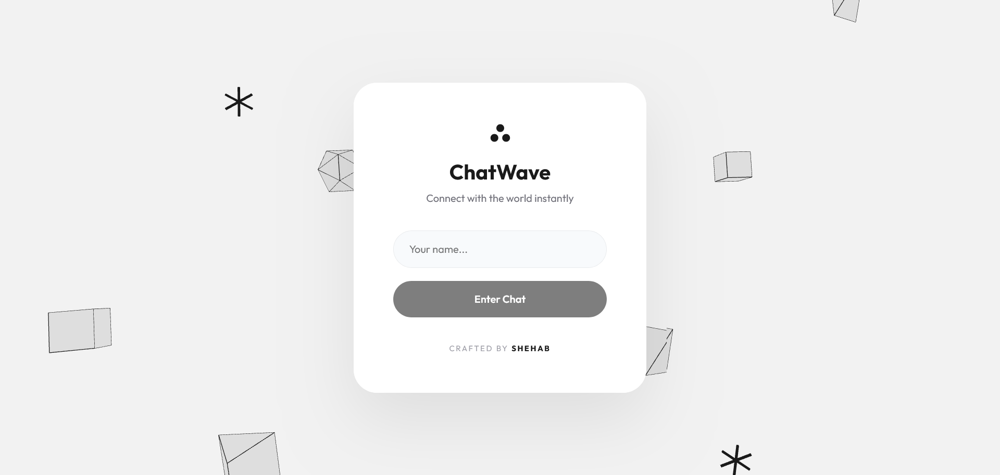
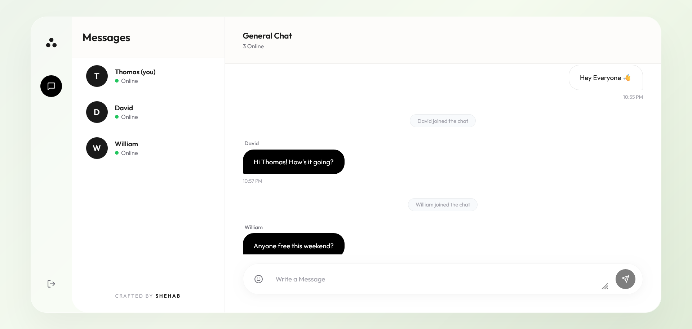
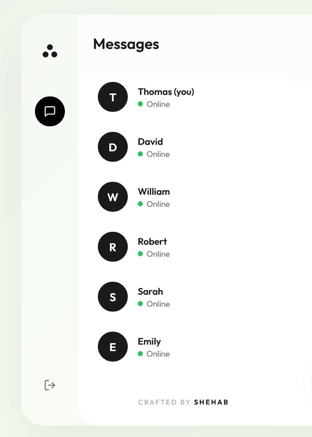

# 💬 Real-Time Chat Application

**Internship Task at CODTECH IT SOLUTIONS**

  <h3>Internship Details</h3>
  <table>
    <tr>
      <td><strong>Company</strong></td>
      <td>CODTECH IT SOLUTIONS</td>
    </tr>
    <tr>
      <td><strong>Name</strong></td>
      <td>SHEHAB MOHAMMAD SADIQUE</td>
    </tr>
    <tr>
      <td><strong>Intern ID</strong></td>
      <td>CTIS8896</td>
    </tr>
    <tr>
      <td><strong>Domain</strong></td>
      <td>MERN STACK WEB DEVELOPMENT</td>
    </tr>
    <tr>
      <td><strong>Duration</strong></td>
      <td>6 WEEKS</td>
    </tr>
    <tr>
      <td><strong>Mentor</strong></td>
      <td>NEELA SANTHOSH</td>
    </tr>
  </table>

---

## 📝 Project Description

This project is a modern, high-performance **Real-Time Chat Application** built as part of my MERN Stack Web Development internship at CODTECH IT SOLUTIONS. It demonstrates the implementation of seamless, instantaneous communication between users leveraging modern web technologies. 

At its core, the application utilizes **React.js** for building a dynamic, responsive, and visually stunning user interface, combined with **Node.js** and **Express.js** on the backend to handle robust API requests. The real-time messaging capabilities are powered by **Socket.io**, ensuring that messages are delivered instantly with minimal latency and no page reloads. The application features a premium, modern design language, including a unique 3D-inspired login experience and a sleek, intuitive chat interface that provides a smooth user experience across devices. 

**Key Features Include:**
- **Instant Messaging:** Real-time bi-directional communication using WebSockets.
- **Modern UI/UX:** A premium, beautifully crafted interface with attention to aesthetics, smooth transitions, and responsive design.
- **3D Login Experience:** An interactive, visually appealing login screen that sets a high-end tone from the very beginning.
- **Clean Architecture:** Well-structured client-server architecture separating frontend views from backend real-time logic.

This application serves as a comprehensive demonstration of full-stack development skills, focusing not just on core chat functionality but also on creating an engaging, premium user experience.

---

## 📸 Screenshots

### 1. Interactive Login Screen
> A beautifully crafted login interface featuring floating 3D elements and a sleek authentication card.

### 2. Main Chat Interface
> The primary dashboard where users can interact, send messages, and view active conversations.

### 3. Sidebar and Navigation
> The sleek sidebar showing active chats and quick navigation options.

---

## 🚀 Tech Stack

- **Frontend:** React.js, Vite, Custom Vanilla CSS (for premium styling)
- **Backend:** Node.js, Express.js
- **Real-Time Engine:** Socket.io

---

  <h3>Crafted by SHEHAB</h3>

